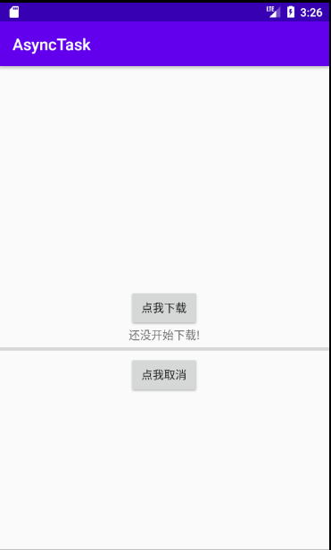
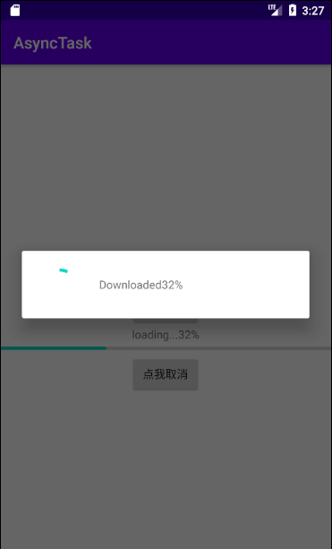
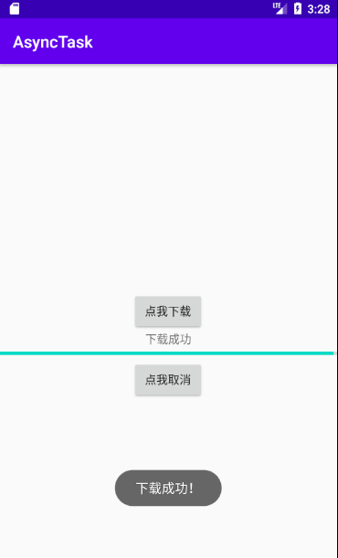

# 异步任务的隐含子线程程序框架。

界面

点击按钮进行模拟下载

下载成功

## 使用时的注意点

在使用`AsyncTask`时有一些问题需要注意的：

### 1.关于 生命周期

- 结论
   `AsyncTask`不与任何组件绑定生命周期
- 使用建议
   在`Activity` 或 `Fragment`中使用 `AsyncTask`时，最好在`Activity` 或 `Fragment`的`onDestory（）`调用 `cancel(boolean)`；

### 2.关于 内存泄漏

- 结论
   若`AsyncTask`被声明为`Activity`的非静态内部类，当`Activity`需销毁时，会因`AsyncTask`保留对`Activity`的引用 而导致`Activity`无法被回收，最终引起内存泄露
- 使用建议
   `AsyncTask`应被声明为`Activity`的静态内部类

### 3.线程任务执行结果 丢失

- 结论
   当`Activity`重新创建时（屏幕旋转 / `Activity`被意外销毁时后恢复），之前运行的`AsyncTask`（非静态的内部类）持有的之前`Activity`引用已无效，故复写的`onPostExecute()`将不生效，即无法更新UI操作
- 使用建议
   在`Activity`恢复时的对应方法 重启 任务线程